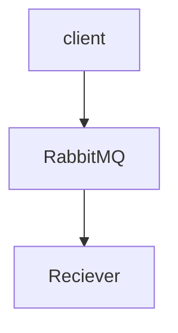

# Overview

This was a small demo I wanted to work on to use RabbitMQ and see how it could work in a larger setting.

## Instructions

To run this for yourself, just clone and run both console apps, and then run a docker container of RabbitMQ:

`docker run -d --hostname my-rabbit --name rabbit -p 5672:5672 -p 15672:15672 rabbitmq:management`

from there just type into the console recieving messages, and it should send them to the other console app and print out the message

